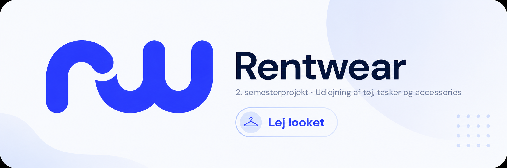

# RENTWEAR

Rentwear er vores 2. semesterprojekt, hvor vi har udviklet en udlejningsplatform til tøj, tasker og accessories.
Formålet med projektet er at gøre det nemt for brugere at leje items af hinanden på en mere bæredygtig, fleksibel og brugervenlig måde.

## Om projektet

Projektet tager udgangspunkt i en webapplikation, hvor brugere kan finde, leje og udleje tøj til forskellige anledninger. 
Brugeren kan søge efter produkter, se produktdetaljer, vælge størrelse og lejeperiode samt se information om den bruger, der udlejer produktet.

Rentwear har fokus på:
- Brugervenligt design
- Bæredygtig mode og fast-fashion
- Tryg udlejning mellem brugere
- Overskuelig navigation
- Moderne UI med tydelig produktvisning

## Funktioner

- Forside med kategorier og populære items
- Produktdetaljeside
- Brugerprofiler for udlejere
- Lejebekræftelsesside
- Visning af officielle brandbilleder på produkter
- Visning af udlejerens eget profilbillede
- Favoritter
- Kurv / booking
- Søgefunktion
- Navigation via sidebar

## Database

Vi bruger SQLite som database i projektet, fordi det er simpelt, let at sætte op og passer godt til et mindre semesterprojekt. SQLite kræver ikke en separat databaseserver, hvilket gør det nemmere at arbejde med lokalt under udviklingen.

## Design

Designet er lavet med fokus på et rent og moderne udtryk. Rentwear bruger blå som primær farve, lyse baggrunde, afrundede hjørner og simple ikoner.

I projektet har vi arbejdet med:
- Wireframes
- UI mockups
- Brand guide
- Farver og typografi
- Brugeroplevelse
- Gestaltprincipper

## Målgruppe

Målgruppen er brugere, der ønsker at leje tøj til særlige anledninger som fester, bryllupper eller events, uden nødvendigvis at købe nyt tøj hver gang.
